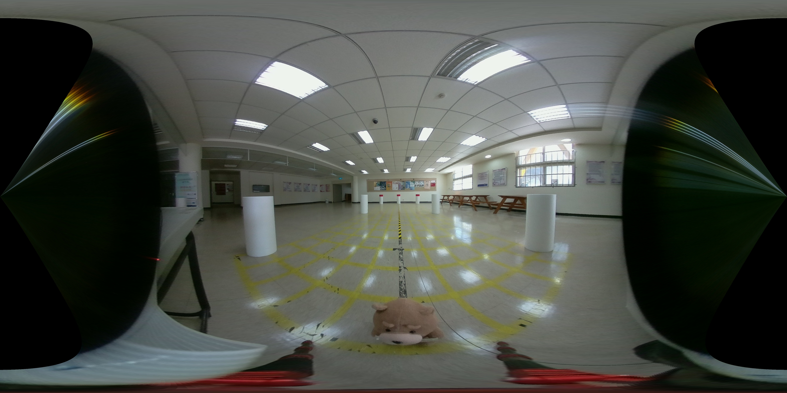
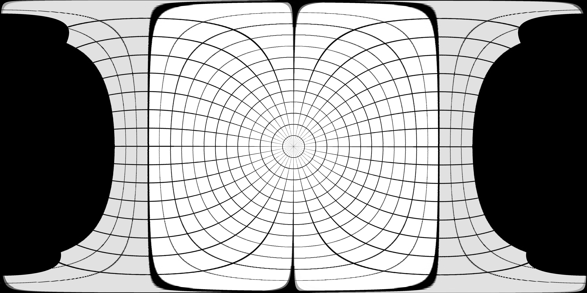
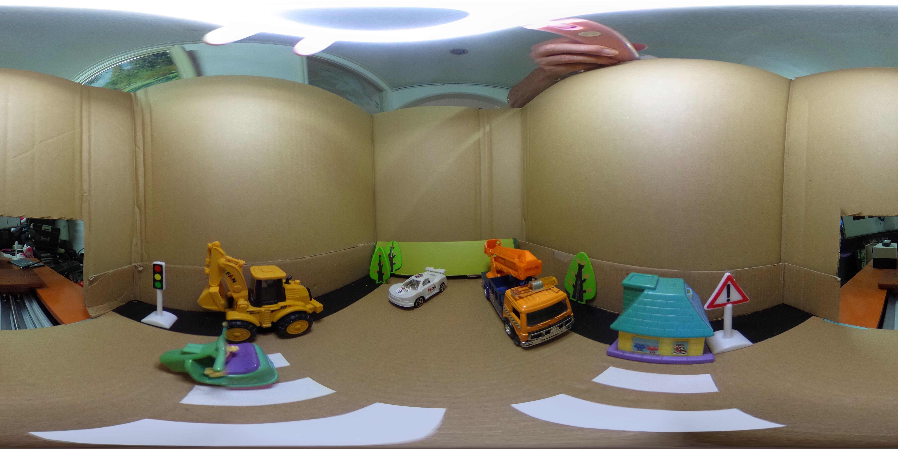
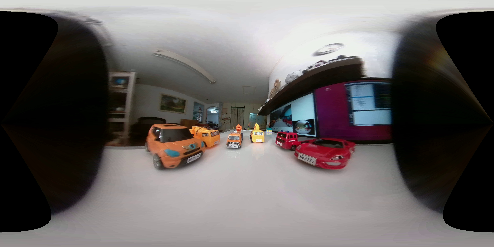

# moil_pannellum

## 1. Purpose

Pannellum is a open source panorama viewer for the web. We connect the web viewer with our MOIL http server. In case the network is speed fast enough, the client could smoothly browse the 360 degree live video source.      

An example : 
http://moil.caece.net/pannellum/

MOIL 轉換成Panorama 提供給 Pannellum 作360 瀏覽
Photo Sphere XMP 中繼資料 描述  部分球形影像
https://developers.google.com/streetview/spherical-metadata

簡單測試
https://pannellum.org/documentation/overview/tutorial/
把Panorama 放在另外一個資料來源, 需要在Apache2 中設定CORS

Demo 網站
http://moil.caece.net/pannellum/

Apache 支援CORS 參考
https://codertw.com/%E4%BC%BA%E6%9C%8D%E5%99%A8/381332/

** 注意 : 提供 Pannellum 的 Panorama 影像為 Moil Mode 2 (Pitch/ Yaw), 請勿使用 Mode 1 (Pitch/ Roll) 

可以由 qt_mainmoil_cuda 專案 DEBUG mode 在主畫面( Anypoint) 中滑鼠右鍵輸出 Panorama, 或由以下專案任一輸出

### 1. moil_httpserver ( https://github.com/yourskc/moil_httpserver ) 

### 2. mainmoil_cuda_cli ( https://github.com/yourskc/ mainmoil_cuda_cli ) 

另一種作法，基於 Pano2vr, 因為轉換六面的方式差異較大，目前不採用，僅供參考

Demo ( Endoscope ):
http://moil.caece.net/moilweb/

## 2. Demo 

1. MCUT

2. Latlon_5376 

3. Toycar

4. ALPR

